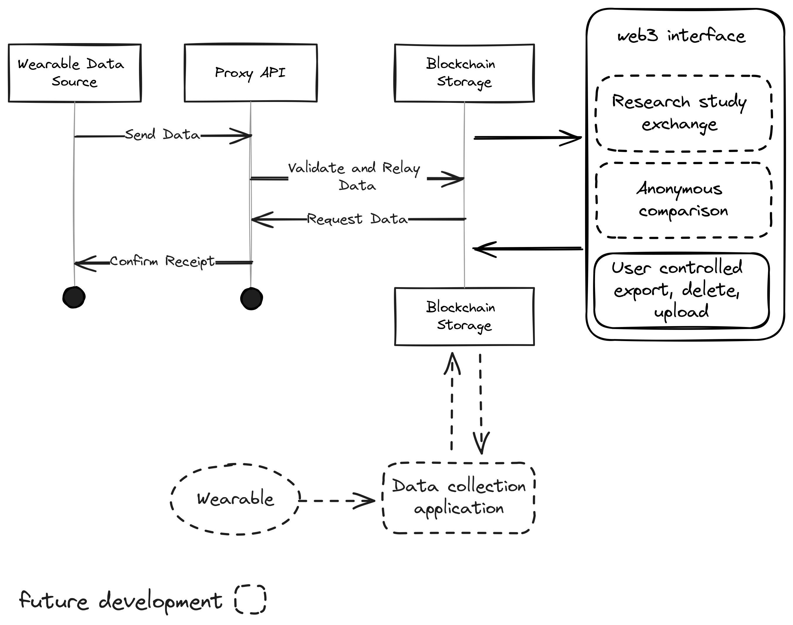

# ic-mind-body-dashboard

## About:
This repository provides tooling for a user controlled method for hosting wearable data on a blockchain network through the [Internet Computer](https://internetcomputer.org), Blueberry was used as an example.

A web toolkit (server and web application interface) for storing fitness, heart, motion and cognitive data on blockchain to enable people and businesses to take control of their data.

## Architechture:

## Get started locally:

* clone repository to local directory
* `cd ic-mind-body-dashboard`
* `npm run cleanup`
* `npm install`
* `npm run dev`

## 📦 Deployment to mainnet

* [setup your canister wallet follow ic guide](https://internetcomputer.org/docs/current/developer-docs/setup/deploy-mainnet)
* `npm run cleanup`
* ensure "build": "parcel src/mind_body_assets/src/index.html", is set in package.json
* `npm run dev`
* modify generated app.*******.js file in dist/ folder to adjust associated canisterId for front end
* `const cansiterId = “pvznn-pyaaa-aaaan-qlljq-cai” (test deployment backend id)`
* ensure "build": "", is set in package.json

### manually edit /dist for favicon:
* add  <link rel="icon" href="./favicon.ico" />
* add your favicon.ico to dist folder

### mainnet deployment
* `dfx deploy --network ic`

### mainnet test application:
* frontend: https://pa64a-oqaaa-aaaan-qllka-cai.icp0.io/
* backend: https://a4gq6-oaaaa-aaaab-qaa4q-cai.raw.icp0.io/?id=pvznn-pyaaa-aaaan-qlljq-cai

## 🔑 Key Components
- /src/mind_body/main.mo - contains HTTP outcall requests to proxy API, put and delete functions for single data hashmap
- /scr/mind_body_assets/src/sections/mydata/view/mydata-view.jsx - contains front end API call requests to motoko backend, encryption and decryption of data and plotting of data into table & chart format
- /src/mind_body_assets/src/sections/login/login-view.jsx - contains web3 identity setting
- /src/mind_body_assets/src/blueberry/BlueberryDictionaryCompression.jsx - compressing data into a vectorized for to and from dictionary format
- /src/mind_body_assets/src/blueberry/CostEstimation.jsx - fixed cost estimation based on publically available rates on ICP's website

## 🛠️ Technology Stack

- [React](https://reactjs.org/): a component-based UI library
- [Motoko](https://github.com/dfinity/motoko#readme): a safe and simple programming language for the Internet Computer
- [mo-dev](https://github.com/dfinity/motoko-dev-server#readme): a live reload development server for Motoko

## 📚 Reference

- [UI template - MIT license](https://github.com/minimal-ui-kit/material-kit-react?ref=reactjsexample.com)
- [React template - Apache 2.0 license](https://github.com/krpeacock/dfx-template-react)
- [README reference](https://raw.githubusercontent.com/rvanasa/vite-react-motoko/main/README.md)
- [Internet Computer docs](https://internetcomputer.org/docs/current/developer-docs/ic-overview)
- [`dfx.json` reference schema](https://internetcomputer.org/docs/current/references/dfx-json-reference/)
- [Motoko developer docs](https://internetcomputer.org/docs/current/developer-docs/build/cdks/motoko-dfinity/motoko/)